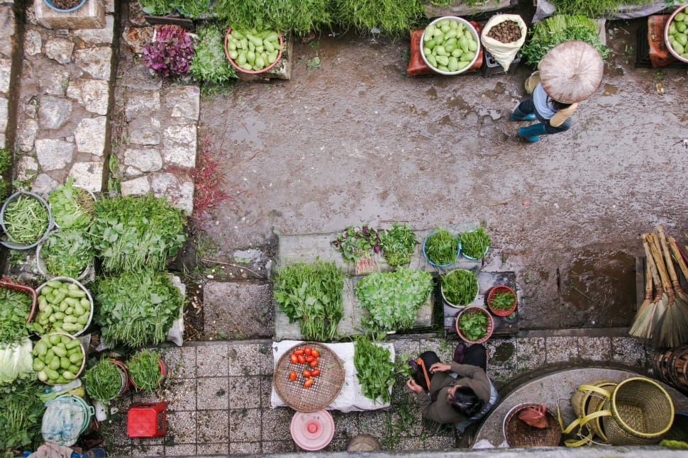

# Telegram Media Gardener - Keep your chat media together, in one place.


(Image license: Creative Commons Zero - CC0, [source](https://www.peakpx.com/437865/aerial-photography-of-vegetable-market))

## Overview

The Telegram Media Gardener bot serves as a seamless service to bridge Telegram with various photo and media storage solutions. Initially designed for Google Photos, its modular architecture can be extended to support other storage backends like SFTP, Nextcloud, PrismPhotos, Dropbox, ..., .

## Architecture

### Storage Backend Drivers

The architecture is designed to be modular and extendable on the storage backend side. You can easily swap in different storage backend 'drivers' to handle the storage of photos and other media.

- **Google Photos**: Pre-built driver for Google Photos
- **NextCloud**: (Future)
- **PrismPhotos**: (Future)

## Features

- Support for multiple file types (photos, videos, etc.)
- Extendable to various storage backends
- User-friendly (just forward any media you want to store to the bot)
- Secure and reliable (all communication are encrypted via TSL)

## Setup

### Prerequisites

- Node.js
- TypeScript
- ...

### Installation

TODO: dockerize the setup and installation
```bash
npm install
```

### Configuration

TODO: Explain how to configure the bot token, Google Photos API credentials, etc.

## Usage

TODO: Explain how to run the bot and perform basic operations.

## Contributing

TODO: Guidelines for contributing to the project.

## License
GNU General Public License v3.0

## Project directory structure

```
telegram-media-gardener/
├── src/
│ ├── drivers/
│ │ ├── GooglePhotosDriver.ts
│ │ ├── DropboxDriver.ts // Future
│ │ └── PrismPhotosDriver.ts // Future
│ ├── models/
│ │ └── ...
│ ├── services/
│ │ └── TelegramService.ts
│ └── main.ts
├── dist/
├── node_modules/
├── tests/
├── package.json
├── tsconfig.json
└── README.md
```

## For the ones coming here trough search engines

### Questions and keywords to make easier to find this bot

- how to connect telegram with google photos?
- telegram bot upload google photos

and in the future, trough adding new [storage drivers](./src/drivers/):

- integration telegram next cloud
- dropbox telegram integration